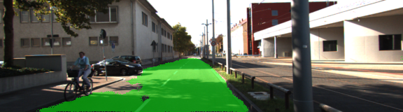
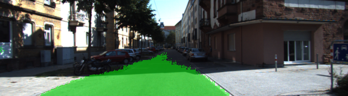

# Semantic Segmentation
### Introduction
In this project, you'll label the pixels of a road in images using a Fully Convolutional Network (FCN).
Due to hardware limitations the current implementation classify only the roads.

### Build the Neural Network

#### Model assembly  
The projects extends and fine-tune a standard VGG, after loading (main.py:35), the model is converted to a 
Fully Convolutional Network, by replacing FC layers used for classifications with a 1x1 convolution classifier using one filter 
for each of the classes. This operation is also performed on the skipping layers (VGG3, VGG4) to obtain a compatible size.
The resulting layer is upscaled 3 (x2,x2,x4) times to match the size of the original image, two skipping layers are added in the process 
to reintegrate part of the information lost due to pooling and convolutions which facilitate the propagation of the gradient during training.

```
# vgg layer aggregation to matching channel size
vgg_3 = tf.layers.conv2d(vgg_layer3_out, num_classes, 1, padding="same",kernel_regularizer=k_reg(reg_scale))
vgg_4 = tf.layers.conv2d(vgg_layer4_out, num_classes, 1, padding="same",kernel_regularizer=k_reg(reg_scale))
vgg_7 = tf.layers.conv2d(vgg_layer7_out, num_classes, 1, padding="same",kernel_regularizer=k_reg(reg_scale))

# decoder composition
# upscale x2 the last layer convolutional layer of VGG and add layer VGG4
dec_1_x2 = tf.layers.conv2d_transpose(vgg_7, num_classes, 4, 2,  padding="same",kernel_regularizer=k_reg(reg_scale))
dec_2_sk = tf.add(dec_1_x2, vgg_4)

# upscale x2 the layer above and add layer VGG3
dec_3_x4 = tf.layers.conv2d_transpose(dec_2_sk, num_classes, 4,2,padding="same",kernel_regularizer=k_reg(reg_scale))
dec_4_sk = tf.add(dec_3_x4, vgg_3)

# upscale x4 the layer above
dec_5_x4 = tf.layers.conv2d_transpose(dec_4_sk, num_classes,16,8,padding="same",kernel_regularizer=k_reg(reg_scale))
```

#### Operations

The correct labels and the final layer are reshaped to compute the cross entropy which is then used my the the Adam optimizer as training operation.

```
# reshape logits and label to fit softmax operation
logits = tf.reshape(nn_last_layer, (-1, num_classes))
correct_label = tf.reshape(correct_label, (-1, num_classes))

#define loss and training operations
cross_entropy_loss = tf.reduce_mean(tf.nn.softmax_cross_entropy_with_logits(logits=logits, labels=correct_label))
optimizer = tf.train.AdamOptimizer(learning_rate).minimize(cross_entropy_loss)
```

#### Training

The model is trained for 200 epochs. A batch size of 15, have been chosen at it is the maximum size that doesn't trigger a memory allocation warning.  
For each batch the loss is accumulated and reported at the end of each epoch as average loss, for debugging purpose is possible to print the loss for each batch as it give a good intuition of the training.  

```
print("init vars")
sess.run(tf.global_variables_initializer())

lr = 0.001
kp = 0.5
# TODO: Implement function
for epoch in range(epochs):
    print("Epoch:", epoch)
    epoch_loss = 0
    cnt = 0
    for image, label in get_batches_fn(batch_size):
        cnt += len(image)
        operations = [
            train_op,
            cross_entropy_loss
        ]

        params = {
            input_image: image,
            correct_label: label,
            learning_rate: lr,
            keep_prob: kp
        }
        train_result,loss = sess.run(operations, params)
        #print("Batch:", cnt,"\t", loss)
        epoch_loss += loss

    avg_cost = epoch_loss/cnt
    print("AVG Loss:", avg_cost)
```

I've tried a few options for the epoch, where with 50 the result was still too imprecise, with 100 there where a good overall result.
With 200 the result is much more polished and the contour of the area are smooth and continuous (see below). 
By looking at the output below looks plausible that with more epochs it would be possible to decrease the training loss even further,
however, by looking at the result on the test images I had the feeling that my network was showing signs of overfitting the training set, 
but in the absence of a validation test or test labels was hard to have a definitive answer. So I decided to keep the 200 epoch result.

```
Epoch: 177
AVG Loss: 0.00133052737707
Epoch: 178
AVG Loss: 0.00133196609965
Epoch: 179
AVG Loss: 0.00132485512953
Epoch: 180
AVG Loss: 0.00130057123822
Epoch: 181
AVG Loss: 0.00135127964807
Epoch: 182
AVG Loss: 0.00145419182701
Epoch: 183
AVG Loss: 0.00144146350261
Epoch: 184
AVG Loss: 0.00136569571266
Epoch: 185
AVG Loss: 0.00132845296399
Epoch: 186
AVG Loss: 0.00130133665002
Epoch: 187
AVG Loss: 0.00129555880211
Epoch: 188
AVG Loss: 0.00126191639828
Epoch: 189
AVG Loss: 0.00125892075571
Epoch: 190
AVG Loss: 0.00123154353608
Epoch: 191
AVG Loss: 0.0012399347267
Epoch: 192
AVG Loss: 0.00126214129174
Epoch: 193
AVG Loss: 0.00123770648749
Epoch: 194
AVG Loss: 0.00121119841095
Epoch: 195
AVG Loss: 0.00117188579947
Epoch: 196
AVG Loss: 0.00115546816799
Epoch: 197
AVG Loss: 0.00116105046072
Epoch: 198
AVG Loss: 0.0011562645358
Epoch: 199
AVG Loss: 0.00112396013958
Save
Training Finished. Saving test images to: ./runs/1510686717.6477408
```

#### Results

100 Epochs                         |                         200 Epochs
:---------------------------------:|:-----------------------------------:
  |  
  |  
  |  
  |  

#### Conclusions

By observing the results, the model could greatly benefit from the introduction of additional classes, starting from cars and sidewalks, 
as currently they are causing most of the false positive detections.
The other major issue appear to be caused by shadows and overexposure, which suggest that data augmentation with contrast, 
brightness and the introduction of random partial shadowing could increase the overall performance in detection.  